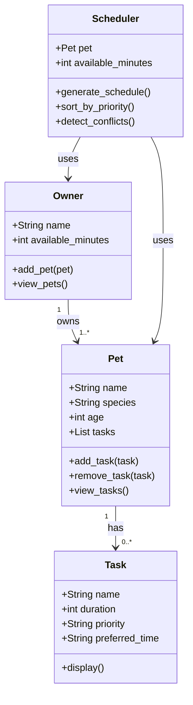

# PawPal+ Project Reflection

## 1. System Design

**a. Initial design**

The three core actions a user should be able to perform in PawPal+:

1. **Add a pet** — The user enters basic information about their pet (name, species, age). This is the foundation of the system; all tasks and schedules are tied to a specific pet.

2. **Add and edit care tasks** — The user creates tasks such as feeding, walks, medications, or grooming. Each task has a duration and a priority level so the scheduler knows what matters most.

3. **Generate a daily schedule** — The user requests a daily plan. The system organizes tasks based on priority and the owner's available time, then displays the plan with a brief explanation of its reasoning.

The system is built around four main classes:

- **Owner**: Holds the owner's name and available time per day (in minutes). Can add pets and view all their pets.
- **Pet**: Holds the pet's name, species, age, and a list of care tasks. Can add and remove tasks.
- **Task**: Holds the task name, duration (in minutes), priority (high/medium/low), and preferred time of day (morning/afternoon/evening). Can display its own details.
- **Scheduler**: Takes a Pet and an Owner's available time and generates a prioritized daily plan. It sorts tasks by priority and detects conflicts (tasks that exceed available time).

Relationships: An Owner has one or more Pets. A Pet has a list of Tasks. The Scheduler uses both the Pet and the Owner to produce the daily plan.

UML diagram (Mermaid.js):

**b. Design changes**

Yes, one change was made during the review of the skeleton. The `Scheduler` class originally accepted `available_minutes` as a plain integer. This was changed so that `Scheduler` takes the full `Owner` object instead. This means the Scheduler can access `owner.available_minutes` directly and will always stay in sync if the owner's available time changes. Passing just a number was a bottleneck — it disconnected the Scheduler from the Owner and could cause inconsistencies.

---

## 2. Scheduling Logic and Tradeoffs

**a. Constraints and priorities**

The scheduler considers three constraints: the owner's total available time per day (in minutes), the priority of each task (high/medium/low), and the preferred time of day (morning/afternoon/evening). It also considers task frequency — daily tasks always appear, while weekly tasks only appear when flagged.

Priority was treated as the most important constraint because it reflects urgency and the pet's health needs. A missed medication is more serious than a missed playtime session. Available time was the second constraint — it acts as a hard cap. Time of day was treated as a soft preference used for ordering the final plan, not for filtering tasks out.

**b. Tradeoffs**

The scheduler uses broad time slots (morning, afternoon, evening) rather than exact start and end times. This means it can detect that a slot is overloaded in total minutes, but it cannot detect that two specific tasks at 8:00 AM and 8:15 AM literally overlap minute-by-minute.

This tradeoff is reasonable for this scenario because pet owners think in terms of general time-of-day routines, not precise timestamps. A morning walk and morning feeding don't need exact scheduling — they just need to both happen in the morning. Exact-time conflict detection would add significant complexity (tracking start times, end times, sorting by clock time) without meaningful benefit for a daily pet care planner. The slot-based approach is simpler to reason about, easier to maintain, and still catches the most common problem: too many tasks crammed into one part of the day.

---

## 3. AI Collaboration

**a. How you used AI**

AI was used at every phase of the project. In Phase 1, it helped brainstorm the four-class architecture and generate the initial UML diagram from a plain-English description of the system. In Phase 2, it scaffolded the class skeletons and suggested using Python dataclasses for Task and Pet to reduce boilerplate. In Phase 4, it helped design the conflict detection strategy and suggested using `timedelta` for recurring task scheduling. In Phase 5, it drafted the initial test functions, which were then reviewed and extended with edge cases.

The most helpful prompts were specific and context-anchored — for example, "Based on my skeletons in pawpal_system.py, how should the Scheduler retrieve all tasks from the Owner's pets?" gave a precise, usable answer, whereas vague prompts like "help me with scheduling" produced generic responses.

**b. Judgment and verification**

When asked to simplify `filter_by_frequency`, the AI suggested replacing the readable condition with a set union operation: `allowed = {"daily"} | ({"weekly"} if is_weekly_day else set())`. While this is more Pythonic and slightly more efficient, it requires understanding set operations — making it harder for a reader unfamiliar with Python sets to follow the logic. The original version reads almost like plain English: "keep it if it's daily, or if it's weekly and today is a weekly day." The original was kept because readability was prioritized over cleverness. The AI suggestion was verified by running both versions against the test suite — both passed — confirming the decision was a style choice, not a correctness issue.

---

## 4. Testing and Verification

**a. What you tested**

The test suite covers 14 behaviors across two categories. Happy paths include: task completion changing status, adding a task increasing the pet's count, daily and weekly recurrence producing correct next due dates, the auto-addition of the next task occurrence, time-of-day sorting, pending task filtering, conflict detection warnings, and weekly tasks being excluded on non-weekly days. Edge cases include: generating a schedule for a pet with no tasks, skipping a task that exceeds available time, filtering when all tasks are complete, completing a non-existent task name, and calling get_all_tasks on an owner with no pets.

These tests matter because they verify both the intended behavior and the system's ability to handle mistakes gracefully without crashing.

**b. Confidence**

Confidence level: 4/5. The core scheduling pipeline — priority sorting, time-of-day ordering, conflict detection, and recurring task logic — is fully covered. The gap is exact-timestamp conflict detection: two tasks in the same broad slot (e.g., both "morning") are warned about collectively, but the system doesn't calculate whether they literally overlap minute by minute. If given more time, the next tests would cover: an owner with multiple pets generating one combined schedule, tasks with identical names on the same pet, and scheduling behavior when available time is exactly zero.

---

## 5. Reflection

**a. What went well**

The CLI-first workflow was the most effective part of the process. By building and verifying all logic in `pawpal_system.py` and `main.py` before connecting the UI, every Streamlit button had a proven, tested method behind it. This meant the UI integration in Phase 3 was straightforward — it was just wiring, not debugging. The test suite also caught a real design issue early: `mark_complete()` originally returned nothing, but the recurring task feature required it to return the next Task object. The tests made that gap visible immediately.

**b. What you would improve**

The biggest improvement would be supporting multiple active pets in a single schedule view. Currently the Scheduler works one pet at a time. A real owner with two dogs and a cat wants to see the full day across all pets in one organized plan. This would require the Scheduler to accept an Owner directly (instead of a single Pet), group tasks by pet, and handle the shared time budget across all animals.

**c. Key takeaway**

The most important lesson was that AI is most valuable when you already have a clear design. When prompts were vague, the AI produced generic code. When prompts referenced specific files, classes, and constraints, the output was precise and usable. Acting as the lead architect — making the structural decisions first, then using AI to fill in the implementation — produced a cleaner system than if AI had been asked to design everything from scratch. The human role is not to write every line, but to define the boundaries and verify the results.
