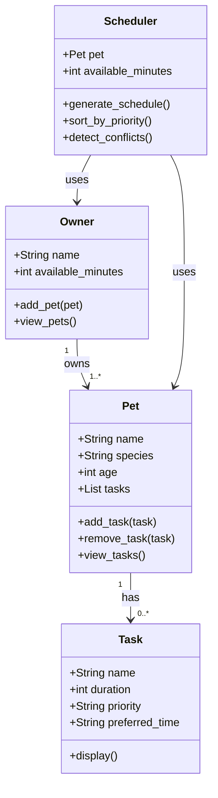

# PawPal+ Project Reflection

## 1. System Design

**a. Initial design**

The three core actions a user should be able to perform in PawPal+:

1. **Add a pet** — The user enters basic information about their pet (name, species, age). This is the foundation of the system; all tasks and schedules are tied to a specific pet.

2. **Add and edit care tasks** — The user creates tasks such as feeding, walks, medications, or grooming. Each task has a duration and a priority level so the scheduler knows what matters most.

3. **Generate a daily schedule** — The user requests a daily plan. The system organizes tasks based on priority and the owner's available time, then displays the plan with a brief explanation of its reasoning.

The system is built around four main classes:

- **Owner**: Holds the owner's name and available time per day (in minutes). Can add pets and view all their pets.
- **Pet**: Holds the pet's name, species, age, and a list of care tasks. Can add and remove tasks.
- **Task**: Holds the task name, duration (in minutes), priority (high/medium/low), and preferred time of day (morning/afternoon/evening). Can display its own details.
- **Scheduler**: Takes a Pet and an Owner's available time and generates a prioritized daily plan. It sorts tasks by priority and detects conflicts (tasks that exceed available time).

Relationships: An Owner has one or more Pets. A Pet has a list of Tasks. The Scheduler uses both the Pet and the Owner to produce the daily plan.

UML diagram (Mermaid.js):

**b. Design changes**

Yes, one change was made during the review of the skeleton. The `Scheduler` class originally accepted `available_minutes` as a plain integer. This was changed so that `Scheduler` takes the full `Owner` object instead. This means the Scheduler can access `owner.available_minutes` directly and will always stay in sync if the owner's available time changes. Passing just a number was a bottleneck — it disconnected the Scheduler from the Owner and could cause inconsistencies.

---

## 2. Scheduling Logic and Tradeoffs

**a. Constraints and priorities**

- What constraints does your scheduler consider (for example: time, priority, preferences)?
- How did you decide which constraints mattered most?

**b. Tradeoffs**

- Describe one tradeoff your scheduler makes.
- Why is that tradeoff reasonable for this scenario?

---

## 3. AI Collaboration

**a. How you used AI**

- How did you use AI tools during this project (for example: design brainstorming, debugging, refactoring)?
- What kinds of prompts or questions were most helpful?

**b. Judgment and verification**

- Describe one moment where you did not accept an AI suggestion as-is.
- How did you evaluate or verify what the AI suggested?

---

## 4. Testing and Verification

**a. What you tested**

- What behaviors did you test?
- Why were these tests important?

**b. Confidence**

- How confident are you that your scheduler works correctly?
- What edge cases would you test next if you had more time?

---

## 5. Reflection

**a. What went well**

- What part of this project are you most satisfied with?

**b. What you would improve**

- If you had another iteration, what would you improve or redesign?

**c. Key takeaway**

- What is one important thing you learned about designing systems or working with AI on this project?
